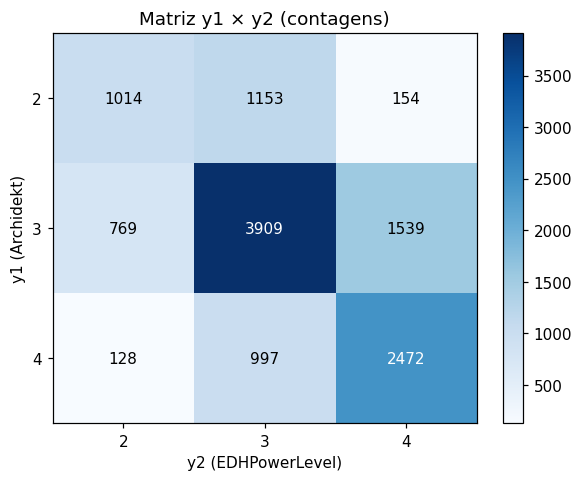
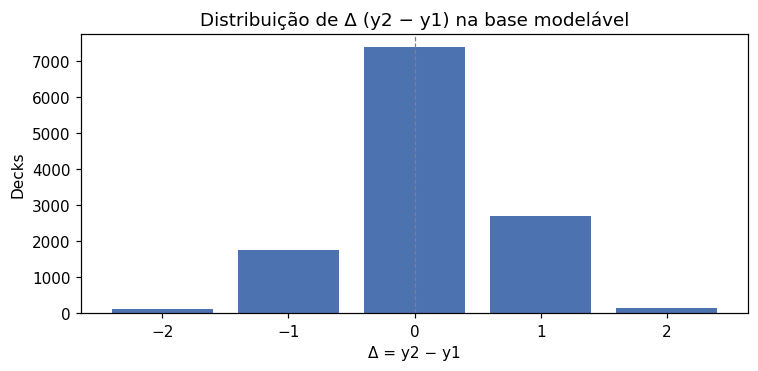
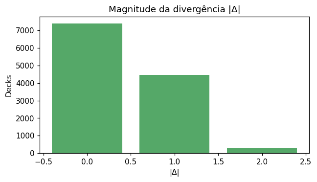
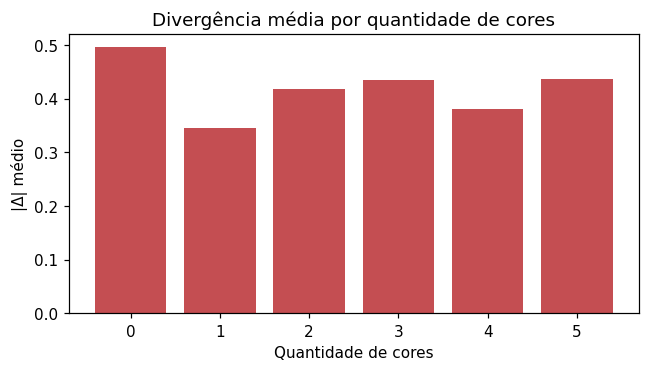
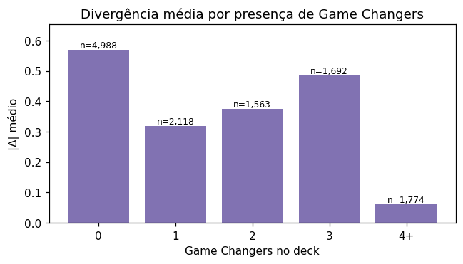

# Análise Direta da Divergência y1 ↔ y2

Esta análise é independente de qualquer modelo. Mede diretamente o quão longe a percepção comunitária (Archidekt, `y1`) está da avaliação automatizada (EDHPowerLevel, `y2`) em decks de Commander.

**Definições**:
```text
delta     = y2 - y1
abs_delta = |y2 - y1|
```

Base usada nesta seção: **12,135 decks** com y1 e y2 ∈ {2,3,4} (subconjunto modelável). Decks com y2 ∈ {1, 5} são analisados em separado na seção 7.

## 1. Estatísticas de concordância

| Critério | Decks | % |
|---|---:|---:|
| Concordância exata (Δ=0) | 7,395 | 60.9% |
| Concordância dentro de ±1 | 11,853 | 97.7% |
| Concordância dentro de ±2 | 12,135 | 100.0% |

**|Δ| médio**: 0.414 · **|Δ| mediano**: 0

## 2. Matriz y1 × y2

Contagens absolutas:

| y1 \ y2 | 2 | 3 | 4 | total |
|---|---:|---:|---:|---:|
| 2 | 1,014 | 1,153 | 154 | 2,321 |
| 3 | 769 | 3,909 | 1,539 | 6,217 |
| 4 | 128 | 997 | 2,472 | 3,597 |

Como % por linha (proporção de y2 dado y1):

| y1 \ y2 | 2 | 3 | 4 |
|---|---:|---:|---:|
| 2 | 43.7% | 49.7% | 6.6% |
| 3 | 12.4% | 62.9% | 24.8% |
| 4 | 3.6% | 27.7% | 68.7% |



## 3. Distribuição de Δ = y2 − y1

| Δ | Decks | % |
|---:|---:|---:|
| -2 | 128 | 1.1% |
| -1 | 1,766 | 14.6% |
| +0 | 7,395 | 60.9% |
| +1 | 2,692 | 22.2% |
| +2 | 154 | 1.3% |



Distribuição de **|Δ|**:

| |Δ| | Decks | % |
|---:|---:|---:|
| 0 | 7,395 | 60.9% |
| 1 | 4,458 | 36.7% |
| 2 | 282 | 2.3% |



## 4. Direção da divergência

| Direção | Decks | % |
|---|---:|---:|
| y2 > y1 (calculadora classifica acima) | 2,846 | 23.5% |
| y2 = y1 | 7,395 | 60.9% |
| y2 < y1 (calculadora classifica abaixo) | 1,894 | 15.6% |

**Tendência**: a calculadora tende a classificar **acima** do Archidekt em 7.8% mais casos. Pode indicar que usuários subestimam decks com sinais objetivos de força (game changers, combos, tutors).

## 5. |Δ| por característica do deck

### Quantidade de cores (`deck_color_count`)

| Bucket | Decks | % com Δ=0 | |Δ| médio | |Δ| mediano |
|---|---:|---:|---:|---:|
| 0 | 115 | 59.1% | 0.496 | 0 |
| 1 | 1,843 | 67.1% | 0.345 | 0 |
| 2 | 4,525 | 60.5% | 0.417 | 0 |
| 3 | 4,681 | 59.2% | 0.434 | 0 |
| 4 | 247 | 63.2% | 0.381 | 0 |
| 5 | 724 | 58.8% | 0.436 | 0 |

### Game Changers (`game_changer_count`)

| Bucket | Decks | % com Δ=0 | |Δ| médio | |Δ| mediano |
|---|---:|---:|---:|---:|
| 0 | 4,988 | 48.6% | 0.568 | 1 |
| 1 | 2,118 | 68.6% | 0.318 | 0 |
| 2 | 1,563 | 62.6% | 0.375 | 0 |
| 3 | 1,692 | 51.7% | 0.484 | 0 |
| 4 | 541 | 84.5% | 0.157 | 0 |
| 5 | 370 | 95.7% | 0.043 | 0 |
| 6 | 310 | 98.4% | 0.016 | 0 |
| 7 | 193 | 100.0% | 0.000 | 0 |
| 8 | 141 | 98.6% | 0.021 | 0 |
| 9 | 89 | 100.0% | 0.000 | 0 |
| 10 | 57 | 100.0% | 0.000 | 0 |
| 11 | 41 | 100.0% | 0.000 | 0 |
| 12 | 17 | 100.0% | 0.000 | 0 |
| 13 | 5 | 100.0% | 0.000 | 0 |
| 14 | 4 | 100.0% | 0.000 | 0 |
| 15 | 2 | 100.0% | 0.000 | 0 |
| 16 | 3 | 100.0% | 0.000 | 0 |
| 19 | 1 | 100.0% | 0.000 | 0 |

### Tutores (`tutor_count`)

| Bucket | Decks | % com Δ=0 | |Δ| médio | |Δ| mediano |
|---|---:|---:|---:|---:|
| 0 | 3,465 | 57.7% | 0.449 | 0 |
| 1 | 2,482 | 58.9% | 0.439 | 0 |
| 2 | 1,834 | 60.9% | 0.416 | 0 |
| 3 | 1,360 | 62.4% | 0.395 | 0 |
| 4 | 1,062 | 64.0% | 0.377 | 0 |
| 5 | 704 | 63.6% | 0.388 | 0 |
| 6 | 447 | 66.2% | 0.353 | 0 |
| 7 | 279 | 67.4% | 0.337 | 0 |
| 8 | 183 | 73.2% | 0.284 | 0 |
| 9 | 104 | 65.4% | 0.346 | 0 |
| 10 | 60 | 60.0% | 0.417 | 0 |
| 11 | 45 | 77.8% | 0.222 | 0 |
| 12 | 28 | 75.0% | 0.250 | 0 |
| 13 | 15 | 60.0% | 0.467 | 0 |
| 14 | 8 | 75.0% | 0.250 | 0 |
| 15 | 8 | 100.0% | 0.000 | 0 |
| 16 | 2 | 100.0% | 0.000 | 0 |
| 17 | 5 | 80.0% | 0.200 | 0 |
| 18 | 2 | 100.0% | 0.000 | 0 |
| 19 | 1 | 100.0% | 0.000 | 0 |
| 20 | 1 | 100.0% | 0.000 | 0 |
| 21 | 3 | 33.3% | 0.667 | 1 |
| 22 | 3 | 100.0% | 0.000 | 0 |
| 23 | 1 | 100.0% | 0.000 | 0 |
| 24 | 3 | 33.3% | 0.667 | 1 |
| 25 | 4 | 75.0% | 0.250 | 0 |
| 26 | 2 | 50.0% | 0.500 | 0 |
| 27 | 3 | 66.7% | 0.333 | 0 |
| 28 | 2 | 50.0% | 0.500 | 0 |
| 30 | 6 | 100.0% | 0.000 | 0 |
| 31 | 2 | 0.0% | 1.000 | 1 |
| 32 | 3 | 66.7% | 0.333 | 0 |
| 33 | 4 | 100.0% | 0.000 | 0 |
| 37 | 1 | 100.0% | 0.000 | 0 |
| 39 | 1 | 100.0% | 0.000 | 0 |
| 44 | 1 | 0.0% | 1.000 | 1 |
| 49 | 1 | 0.0% | 1.000 | 1 |

### Combos de duas cartas (singleton) (`two_card_combo_singleton_count`)

| Bucket | Decks | % com Δ=0 | |Δ| médio | |Δ| mediano |
|---|---:|---:|---:|---:|
| 0 | 12,135 | 60.9% | 0.414 | 0 |

### Preço total (quintis) (`price_total`)

| Bucket | Decks | % com Δ=0 | |Δ| médio | |Δ| mediano |
|---|---:|---:|---:|---:|
| (30.858999999999998, 301.21] | 2,427 | 57.4% | 0.465 | 0 |
| (301.21, 467.102] | 2,427 | 61.5% | 0.406 | 0 |
| (467.102, 688.094] | 2,427 | 60.8% | 0.412 | 0 |
| (688.094, 1032.074] | 2,427 | 58.8% | 0.439 | 0 |
| (1032.074, 62222.67] | 2,427 | 66.3% | 0.347 | 0 |





## 6. Características de decks com Δ>0 vs Δ<0 vs Δ=0

Comparação de médias entre os três grupos para algumas features-chave:

| Feature | Δ<0 (calc abaixo) | Δ=0 | Δ>0 (calc acima) |
|---|---:|---:|---:|
| `game_changer_count` | 0.72 | 2.19 | 1.19 |
| `tutor_count` | 2.15 | 2.47 | 2.08 |
| `extra_turns_count` | 0.10 | 0.19 | 0.17 |
| `two_card_combo_singleton_count` | 0.00 | 0.00 | 0.00 |
| `price_total` | 504.90 | 843.79 | 868.24 |
| `salt_mean` | 0.40 | 0.45 | 0.43 |
| `edhrec_rank_mean` | 3006.90 | 2619.89 | 2281.39 |
| `cmc_mean` | 2.21 | 2.11 | 2.03 |
| `land_count` | 35.06 | 34.99 | 34.92 |

## 7. Decks com y2 ∈ {1, 5} (descartados da modelagem)

Total: **815 decks** (6.3% da base com y2 conhecido). y1 está em {2,3,4} para todos esses decks.

Distribuição cruzada y1 × y2 nesses decks extremos:

| y1 \ y2 | 1 | 5 |
|---|---:|---:|
| 2 | 278 | 2 |
| 3 | 103 | 27 |
| 4 | 12 | 393 |

### y2 = 1 (calculadora muito casual) — top 10 comandantes

| Comandante | Decks |
|---|---:|
| Tovolar, Dire Overlord // Tovolar, the Midnight Scourge | 7 |
| Ellie and Alan, Paleontologists | 6 |
| Hylda of the Icy Crown | 6 |
| Imoti, Celebrant of Bounty | 4 |
| Henzie "Toolbox" Torre | 4 |
| Helga, Skittish Seer | 4 |
| Anje Falkenrath | 3 |
| Codie, Vociferous Codex | 3 |
| Kolodin, Triumph Caster | 3 |
| General Ferrous Rokiric | 3 |

### y2 = 5 (calculadora cEDH-like) — top 10 comandantes

| Comandante | Decks |
|---|---:|
| Y'shtola, Night's Blessed | 11 |
| Nekusar, the Mindrazer | 10 |
| Kefka, Court Mage // Kefka, Ruler of Ruin | 9 |
| Teval, the Balanced Scale | 8 |
| Sauron, the Dark Lord | 6 |
| Captain America, First Avenger | 6 |
| Tivit, Seller of Secrets | 6 |
| Breya, Etherium Shaper | 6 |
| Yuriko, the Tiger's Shadow | 6 |
| Atraxa, Praetors' Voice | 6 |

### Comparação de médias (decks extremos vs base modelável)

| Feature | Base modelável | y2=1 | y2=5 |
|---|---:|---:|---:|
| `game_changer_count` | 1.72 | 0.00 | 10.58 |
| `tutor_count` | 2.33 | 1.09 | 7.19 |
| `two_card_combo_singleton_count` | 0.00 | 0.00 | 0.00 |
| `price_total` | 796.63 | 174.53 | 3819.52 |
| `cmc_mean` | 2.10 | 2.37 | 1.74 |

## 8. Resumo executivo

- **Concordância exata**: 60.9% dos decks na base modelável.
- **Concordância dentro de ±1**: 97.7%.
- **|Δ| médio**: 0.414.
- **Tendência direcional**: y2>y1 em 23.5% vs y2<y1 em 15.6%.
- **Decks com y2 extremo (∉{2,3,4})**: 815 (6.3%).

Esses números são o ponto de partida da Fase G (transferência cross-label) e da Fase I (interpretabilidade): dão a referência contra a qual qualquer modelo será comparado.
