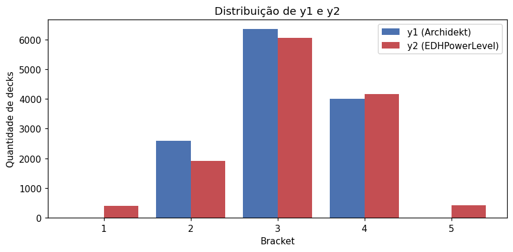
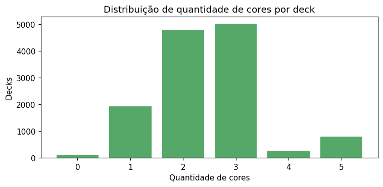
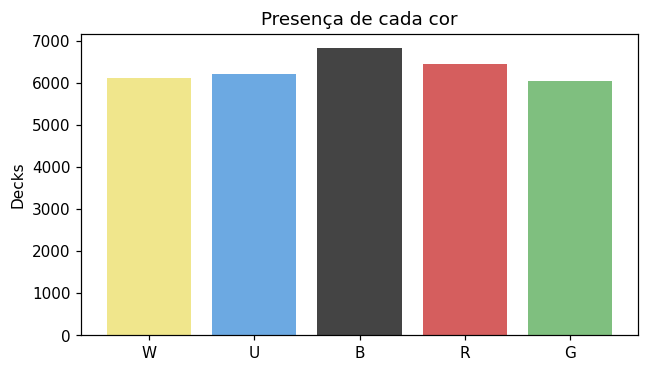
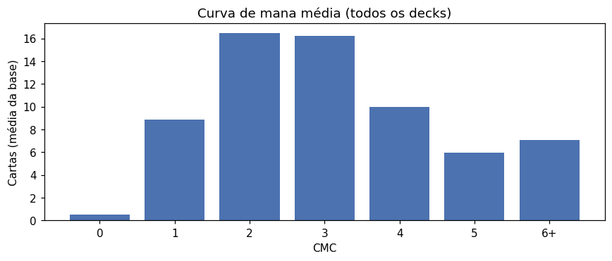
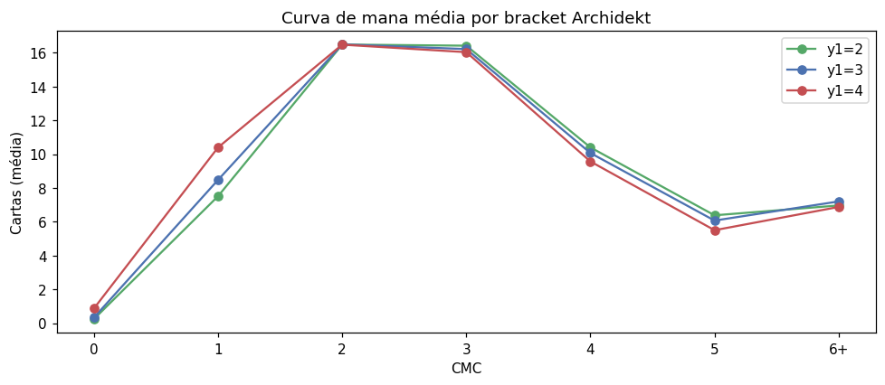
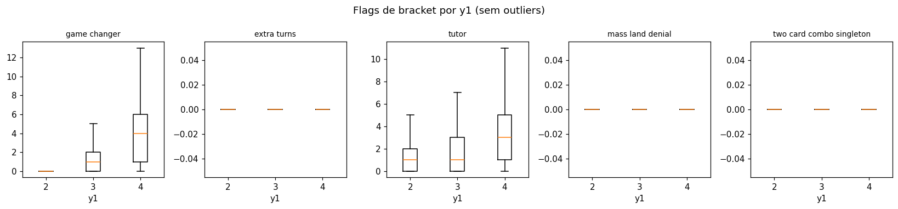
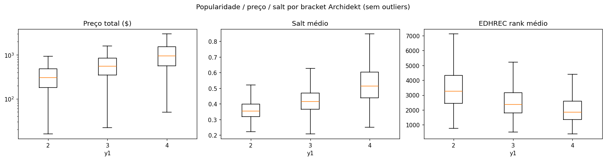
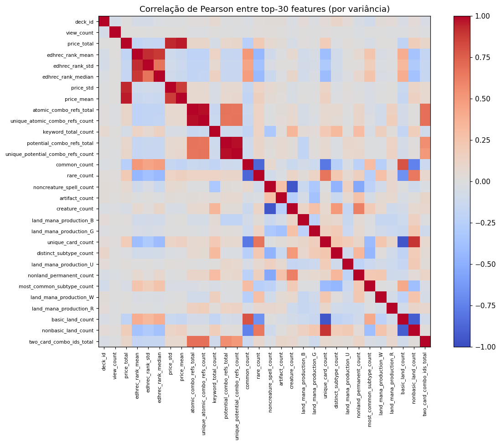

# EDA — Análise Exploratória dos Dados

Base: **12,950 decks** processados (Archidekt y1 ∈ {2,3,4}, ≥1.000 views, 100 cartas no mainboard, validados em Commander). Cada deck tem 114 features agregadas (Deck Features) e duas famílias de label: `y1` (Archidekt, percepção do usuário) e `y2` (EDHPowerLevel, calculadora automatizada).

## 1. Distribuição dos rótulos

### y1 (Archidekt)
| Bracket | Decks | % |
|---:|---:|---:|
| 2 | 2,601 | 20.1% |
| 3 | 6,347 | 49.0% |
| 4 | 4,002 | 30.9% |

### y2 (EDHPowerLevel)
| Bracket | Decks | % |
|---:|---:|---:|
| 1 | 393 | 3.0% |
| 2 | 1,911 | 14.8% |
| 3 | 6,059 | 46.8% |
| 4 | 4,165 | 32.2% |
| 5 | 422 | 3.3% |

**Observação**: a calculadora produz brackets fora de {2,3,4} (b1 e b5), enquanto o Archidekt já vem filtrado nesse intervalo. Para a modelagem multiclasse, manteremos apenas decks com **y1 e y2 ∈ {2,3,4}** (Fase C). Isso descarta 815 decks (6.3%).

## 2. Balanceamento de classes na base modelável

Base modelável: **12,135 decks** (y1 e y2 ∈ {2,3,4}).

### y1 (Archidekt)
| Bracket | Decks | % |
|---:|---:|---:|
| 2 | 2,321 | 19.1% |
| 3 | 6,217 | 51.2% |
| 4 | 3,597 | 29.6% |

### y2 (EDHPowerLevel)
| Bracket | Decks | % |
|---:|---:|---:|
| 2 | 1,911 | 15.7% |
| 3 | 6,059 | 49.9% |
| 4 | 4,165 | 34.3% |

Conclusão: classe 3 domina em ambos os labels. Macro-F1 será a métrica principal (ver Fase E).

## 3. Cores

### Quantidade de cores por deck
| Cores | Decks | % |
|---:|---:|---:|
| 0 | 117 | 0.9% |
| 1 | 1,935 | 14.9% |
| 2 | 4,802 | 37.1% |
| 3 | 5,025 | 38.8% |
| 4 | 275 | 2.1% |
| 5 | 796 | 6.1% |

### Presença de cada cor
| Cor | Decks | % |
|---|---:|---:|
| W | 6,137 | 47.4% |
| U | 6,231 | 48.1% |
| B | 6,832 | 52.8% |
| R | 6,448 | 49.8% |
| G | 6,046 | 46.7% |

## 4. Estrutura do deck

Estatísticas básicas (mediana / média / desvio):

| Feature | Mediana | Média | Desvio |
|---|---:|---:|---:|
| `unique_card_count` | 88.0 | 87.14 | 8.75 |
| `commander_card_count` | 1.0 | 1.07 | 0.40 |
| `land_count` | 35.0 | 34.93 | 3.14 |
| `nonland_count` | 65.0 | 65.07 | 3.14 |
| `basic_land_count` | 14.0 | 14.99 | 7.84 |
| `nonbasic_land_count` | 21.0 | 19.94 | 7.72 |

## 5. Curva de mana

CMC médio por deck (média da base): **2.10** (mediana 2.05).

## 6. Tipos de carta

Médias da base:

| Tipo | Média |
|---|---:|
| `creature_count` | 27.8 |
| `instant_count` | 10.5 |
| `sorcery_count` | 8.2 |
| `artifact_count` | 12.7 |
| `enchantment_count` | 8.7 |
| `planeswalker_count` | 0.8 |
| `land_count` | 34.9 |
| `nonland_permanent_count` | 46.3 |

## 7. Flags de bracket (sinais estruturais)

| Flag | Média | Mediana | % decks com ≥1 |
|---|---:|---:|---:|
| `game_changer_count` | 1.96 | 1 | 58.4% |
| `extra_turns_count` | 0.17 | 0 | 11.8% |
| `tutor_count` | 2.45 | 2 | 71.7% |
| `mass_land_denial_count` | 0.07 | 0 | 4.2% |
| `two_card_combo_singleton_count` | 0.00 | 0 | 0.0% |

## 8. Popularidade, preço e salt

| Feature | Média | Mediana | NaN |
|---|---:|---:|---:|
| `edhrec_rank_mean` | 2658.72 | 2372.70 | 0 |
| `salt_mean` | 0.44 | 0.42 | 0 |
| `price_total` | 876.26 | 568.28 | 0 |
| `price_mean` | 9.41 | 5.87 | 0 |

## 9. Combos

| Feature | Média | Mediana | % decks com ≥1 |
|---|---:|---:|---:|
| `cards_with_atomic_combos_count` | 7.10 | 6 | 99.3% |
| `atomic_combo_refs_total` | 20.48 | 15 | 99.3% |
| `unique_atomic_combo_refs_count` | 17.72 | 13 | 99.3% |
| `two_card_combo_ids_total` | 6.06 | 4 | 86.8% |

## 10. Raridade

| Raridade | Média de cartas/deck |
|---|---:|
| `common_count` | 26.1 |
| `uncommon_count` | 18.9 |
| `rare_count` | 44.2 |
| `mythic_count` | 10.6 |

## 11. Valores faltantes e outliers

Features com valores faltantes:

| Feature | NaN | % |
|---|---:|---:|
| `epl_power_level` | 166 | 1.3% |
| `epl_efficiency` | 82 | 0.6% |
| `epl_score` | 1 | 0.0% |
| `epl_tipping_point` | 1 | 0.0% |

Outliers ilustrativos (top-3 por feature):

| Feature | Top valores |
|---|---|
| `price_total` | [119439.69, 62222.67, 61646.32] |
| `salt_mean` | [1.07, 1.07, 1.05] |
| `edhrec_rank_mean` | [14925.8, 12447.97, 12074.65] |
| `cmc_mean` | [5.12, 4.14, 4.08] |

## 12. Comandantes mais frequentes

| Comandante | Decks | % base |
|---|---:|---:|
| The Ur-Dragon | 111 | 0.9% |
| Pantlaza, Sun-Favored | 88 | 0.7% |
| Teval, the Balanced Scale | 74 | 0.6% |
| Edgar Markov | 70 | 0.5% |
| Y'shtola, Night's Blessed | 67 | 0.5% |
| Kaalia of the Vast | 64 | 0.5% |
| Sauron, the Dark Lord | 63 | 0.5% |
| Lathril, Blade of the Elves | 62 | 0.5% |
| Henzie "Toolbox" Torre | 62 | 0.5% |
| Atraxa, Praetors' Voice | 60 | 0.5% |
| Ms. Bumbleflower | 59 | 0.5% |
| Jodah, the Unifier | 58 | 0.4% |
| Miirym, Sentinel Wyrm | 58 | 0.4% |
| Giada, Font of Hope | 57 | 0.4% |
| Chatterfang, Squirrel General | 54 | 0.4% |

Comandantes únicos na base: **2,064**.
Mediana de decks por comandante: 3.
Decks com ≥2 comandantes (partner/background/etc): 775 (6.0%).

## 13. Correlação entre features (top 30 features numéricas)

