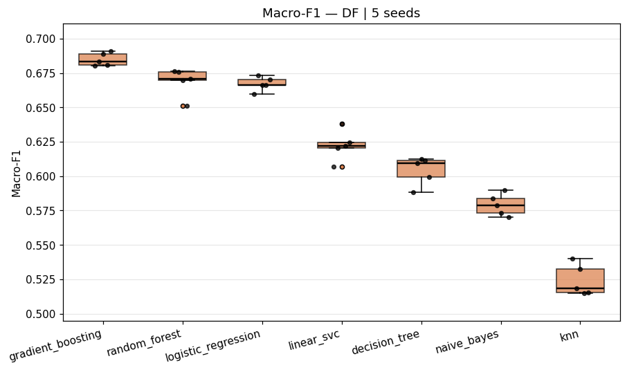
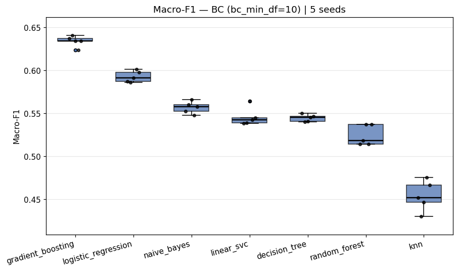

# Spot-checking — Fase D

## Objetivo

Avaliar os 7 algoritmos candidatos viáveis em ambas as representações (BC e DF) com N=5 repetições, reportando média e desvio padrão da macro-F1. A saída define `A_DF` e `A_BC` (top-5 por representação) que alimentam a Fase E.

## Configuração

- `processed_dir`: `data/processed/archidekt`
- `seeds`: `1, 2, 3, 4, 5` (hold-out estratificado 80/20 estratificado por `y1`)
- `test_size`: `0.2`
- `bc_min_df_values`: `5, 10, 20`
- `best_bc_min_df`: `10`
- `use_tfidf`: `False` nesta etapa
- Combinações com sucesso: 28
- Combinações com erro: 0

## Hiperparâmetros testados (defaults sklearn, com ajustes mínimos)

| Algoritmo | DF | BC | Hiperparâmetros |
|---|---|---|---|
| Decision Tree | sim | sim | `DecisionTreeClassifier(random_state=seed)` |
| Random Forest | sim | sim | `RandomForestClassifier(n_estimators=100, random_state=seed, n_jobs=-1)` |
| Gradient Boosting | sim | sim | `HistGradientBoostingClassifier(random_state=seed)`; em BC há conversão controlada de sparse para dense |
| Naive Bayes | sim | sim | DF: `GaussianNB()`; BC: `MultinomialNB()` |
| Logistic Regression | sim | sim | DF: `LogisticRegression(max_iter=1000, solver='lbfgs', random_state=seed)`; BC: `LogisticRegression(max_iter=1000, solver='saga', random_state=seed)` |
| LinearSVC | sim | sim | `LinearSVC(random_state=seed, max_iter=5000)` |
| KNN | sim | sim | `KNeighborsClassifier()`; DF é escalado com `StandardScaler` |

SVC RBF/Poly foram **excluídos do pool** porque a regra do projeto é manter apenas algoritmos viáveis nas duas representações.

## Notas metodológicas

**Hiperparâmetros.** 5 dos 7 algoritmos rodam **100% com defaults do scikit-learn** (`DecisionTree`, `RandomForest`, `HistGradientBoosting`, `NaiveBayes`, `KNN`) — apenas com `random_state=seed` para reprodutibilidade onde aplicável. Apenas dois sofrem ajustes mínimos por estabilidade numérica:

| Algoritmo | Desvio do default | Justificativa |
|---|---|---|
| `LogisticRegression` (BC) | `solver='saga'`, `max_iter=1000` | `lbfgs` (default) não suporta bem matriz esparsa de alta dimensionalidade; `saga` é o solver oficial para esse caso. |
| `LogisticRegression` (DF) | `max_iter=1000` | `max_iter=100` (default) emite warning de convergência na escala 12k×102. |
| `LinearSVC` | `max_iter=5000` | `max_iter=1000` (default) emite warning de convergência na nossa base. |

O sweep estruturado de hiperparâmetros acontece **apenas na Fase E** (grids ≤192 configs por algoritmo). A Fase D é estritamente um filtro de viabilidade com defaults — escolher hiperparâmetros aqui contaminaria a decisão do top-5 com um sweep escondido.

**Estratificação do hold-out.** Cada uma das 5 repetições faz `train_test_split(..., stratify=y, random_state=seed)` com `test_size=0.2`. Tanto treino (80%) quanto teste (20%) preservam a proporção original de classes em `y1` (Archidekt bracket). Isso importa porque `y1=3` é maioria (~52%) e `y1=2` é minoritária (~21%) na base modelável (12.135 decks) — sem estratificação, splits desfavoráveis poderiam concentrar a minoria no teste e enviesar a macro-F1 (que penaliza igualmente todas as classes).

A Fase D **não** tem CV interna: é hold-out 80/20 repetido 5x com seeds distintas mas determinísticas (`{1,2,3,4,5}`). A nested CV completa (`StratifiedKFold(5) × 3 repeats = 15 outer folds`) só aparece na Fase E.

## Macro-F1 por seed — BC (`bc_min_df=10`) vs DF

Cada linha mostra os 5 valores brutos de macro-F1 (um por seed) somados à média e desvio padrão. Permite inspecionar a estabilidade de cada algoritmo separadamente da tabela completa de combinações.

| Algoritmo | Rep | seed=1 | seed=2 | seed=3 | seed=4 | seed=5 | Média | DP |
|---|---|---:|---:|---:|---:|---:|---:|---:|
| `gradient_boosting` | BC | 0.6372 | 0.6411 | 0.6345 | 0.6239 | 0.6345 | 0.6342 | 0.0064 |
| `logistic_regression` | BC | 0.5872 | 0.5859 | 0.5916 | 0.6012 | 0.5976 | 0.5927 | 0.0066 |
| `naive_bayes` | BC | 0.5526 | 0.5604 | 0.5660 | 0.5479 | 0.5581 | 0.5570 | 0.0070 |
| `linear_svc` | BC | 0.5382 | 0.5392 | 0.5644 | 0.5428 | 0.5448 | 0.5459 | 0.0107 |
| `decision_tree` | BC | 0.5500 | 0.5402 | 0.5407 | 0.5454 | 0.5465 | 0.5445 | 0.0041 |
| `random_forest` | BC | 0.5144 | 0.5182 | 0.5370 | 0.5145 | 0.5373 | 0.5243 | 0.0119 |
| `knn` | BC | 0.4517 | 0.4301 | 0.4465 | 0.4756 | 0.4664 | 0.4541 | 0.0177 |
| `gradient_boosting` | DF | 0.6803 | 0.6835 | 0.6890 | 0.6810 | 0.6912 | 0.6850 | 0.0049 |
| `random_forest` | DF | 0.6761 | 0.6756 | 0.6695 | 0.6510 | 0.6707 | 0.6686 | 0.0103 |
| `logistic_regression` | DF | 0.6599 | 0.6731 | 0.6665 | 0.6662 | 0.6705 | 0.6672 | 0.0050 |
| `linear_svc` | DF | 0.6069 | 0.6203 | 0.6383 | 0.6222 | 0.6247 | 0.6225 | 0.0112 |
| `decision_tree` | DF | 0.5884 | 0.6095 | 0.6124 | 0.6113 | 0.5992 | 0.6042 | 0.0102 |
| `naive_bayes` | DF | 0.5837 | 0.5787 | 0.5731 | 0.5900 | 0.5703 | 0.5792 | 0.0080 |
| `knn` | DF | 0.5398 | 0.5182 | 0.5323 | 0.5148 | 0.5154 | 0.5241 | 0.0113 |

## Boxplots: Macro-F1 por algoritmo

Distribuição dos 5 valores de macro-F1 por algoritmo em cada representação. Os pontos pretos sobrepostos são as seeds individuais. Algoritmos ordenados pela média decrescente dentro de cada figura.

### Deck Features (DF)

### Bag of Cards (BC, `bc_min_df=10`)

## Resultados por combinação (média ± desvio padrão sobre 5 seeds)

| Representação | Algoritmo | bc_min_df | Status | n_ok | Macro-F1 média | Macro-F1 dp | Accuracy média | Precision macro | Recall macro | Features | Fit médio (s) |
|---|---|---:|---|---:|---:|---:|---:|---:|---:|---:|---:|
| BC | `decision_tree` | 5 | ok | 5 | 0.5425 | 0.0023 | 0.5636 | 0.5446 | 0.5410 | 13406 | 1.09 |
| BC | `decision_tree` | 10 | ok | 5 | 0.5445 | 0.0041 | 0.5642 | 0.5456 | 0.5439 | 10106 | 1.05 |
| BC | `decision_tree` | 20 | ok | 5 | 0.5348 | 0.0114 | 0.5575 | 0.5368 | 0.5333 | 6861 | 0.93 |
| BC | `gradient_boosting` | 5 | ok | 5 | 0.6342 | 0.0064 | 0.6652 | 0.6587 | 0.6200 | 13406 | 55.41 |
| BC | `gradient_boosting` | 10 | ok | 5 | 0.6342 | 0.0064 | 0.6652 | 0.6587 | 0.6200 | 10106 | 44.53 |
| BC | `gradient_boosting` | 20 | ok | 5 | 0.6342 | 0.0064 | 0.6652 | 0.6587 | 0.6200 | 6861 | 29.66 |
| BC | `knn` | 5 | ok | 5 | 0.4502 | 0.0123 | 0.5089 | 0.4652 | 0.4445 | 13406 | 0.00 |
| BC | `knn` | 10 | ok | 5 | 0.4541 | 0.0177 | 0.5061 | 0.4698 | 0.4494 | 10106 | 0.00 |
| BC | `knn` | 20 | ok | 5 | 0.4434 | 0.0186 | 0.4931 | 0.4671 | 0.4429 | 6861 | 0.00 |
| BC | `linear_svc` | 5 | ok | 5 | 0.5469 | 0.0076 | 0.5773 | 0.5491 | 0.5462 | 13406 | 8.37 |
| BC | `linear_svc` | 10 | ok | 5 | 0.5459 | 0.0107 | 0.5763 | 0.5478 | 0.5452 | 10106 | 7.99 |
| BC | `linear_svc` | 20 | ok | 5 | 0.5345 | 0.0121 | 0.5643 | 0.5360 | 0.5344 | 6861 | 1.60 |
| BC | `logistic_regression` | 5 | ok | 5 | 0.5946 | 0.0079 | 0.6270 | 0.6077 | 0.5858 | 13406 | 5.00 |
| BC | `logistic_regression` | 10 | ok | 5 | 0.5927 | 0.0066 | 0.6244 | 0.6045 | 0.5845 | 10106 | 4.93 |
| BC | `logistic_regression` | 20 | ok | 5 | 0.5911 | 0.0083 | 0.6213 | 0.6011 | 0.5840 | 6861 | 4.40 |
| BC | `naive_bayes` | 5 | ok | 5 | 0.5575 | 0.0088 | 0.5696 | 0.5499 | 0.5723 | 13406 | 0.00 |
| BC | `naive_bayes` | 10 | ok | 5 | 0.5570 | 0.0070 | 0.5667 | 0.5488 | 0.5750 | 10106 | 0.00 |
| BC | `naive_bayes` | 20 | ok | 5 | 0.5580 | 0.0059 | 0.5659 | 0.5497 | 0.5797 | 6861 | 0.00 |
| BC | `random_forest` | 5 | ok | 5 | 0.5123 | 0.0137 | 0.6357 | 0.6832 | 0.5073 | 13406 | 0.39 |
| BC | `random_forest` | 10 | ok | 5 | 0.5243 | 0.0119 | 0.6380 | 0.6753 | 0.5153 | 10106 | 0.38 |
| BC | `random_forest` | 20 | ok | 5 | 0.5431 | 0.0060 | 0.6444 | 0.6863 | 0.5278 | 6861 | 0.37 |
| DF | `decision_tree` |  | ok | 5 | 0.6042 | 0.0102 | 0.6260 | 0.6030 | 0.6057 | 102 | 0.30 |
| DF | `gradient_boosting` |  | ok | 5 | 0.6850 | 0.0049 | 0.7104 | 0.7087 | 0.6715 | 102 | 1.03 |
| DF | `knn` |  | ok | 5 | 0.5241 | 0.0113 | 0.5752 | 0.5544 | 0.5118 | 102 | 0.00 |
| DF | `linear_svc` |  | ok | 5 | 0.6225 | 0.0112 | 0.6789 | 0.6891 | 0.6005 | 102 | 0.76 |
| DF | `logistic_regression` |  | ok | 5 | 0.6672 | 0.0050 | 0.6912 | 0.6910 | 0.6531 | 102 | 0.09 |
| DF | `naive_bayes` |  | ok | 5 | 0.5792 | 0.0080 | 0.5766 | 0.5861 | 0.6287 | 102 | 0.00 |
| DF | `random_forest` |  | ok | 5 | 0.6686 | 0.0103 | 0.7100 | 0.7244 | 0.6436 | 102 | 0.28 |

## Ranking por representação

BC usa apenas o `bc_min_df` escolhido (`10`). DF é ranqueado direto. Top-5 por representação alimenta a Fase E.

### DF

| Rank | Algoritmo | Macro-F1 média | Macro-F1 dp | n_ok | Selecionado (top-5) | Observação |
|---:|---|---:|---:|---:|---|---|
| 1 | `gradient_boosting` | 0.6850 | 0.0049 | 5 | sim |  |
| 2 | `random_forest` | 0.6686 | 0.0103 | 5 | sim |  |
| 3 | `logistic_regression` | 0.6672 | 0.0050 | 5 | sim |  |
| 4 | `linear_svc` | 0.6225 | 0.0112 | 5 | sim |  |
| 5 | `decision_tree` | 0.6042 | 0.0102 | 5 | sim |  |
| 6 | `naive_bayes` | 0.5792 | 0.0080 | 5 | não |  |
| 7 | `knn` | 0.5241 | 0.0113 | 5 | não |  |

### BC

| Rank | Algoritmo | Macro-F1 média | Macro-F1 dp | n_ok | Selecionado (top-5) | Observação |
|---:|---|---:|---:|---:|---|---|
| 1 | `gradient_boosting` | 0.6342 | 0.0064 | 5 | sim |  |
| 2 | `logistic_regression` | 0.5927 | 0.0066 | 5 | sim |  |
| 3 | `naive_bayes` | 0.5570 | 0.0070 | 5 | sim |  |
| 4 | `linear_svc` | 0.5459 | 0.0107 | 5 | sim |  |
| 5 | `decision_tree` | 0.5445 | 0.0041 | 5 | sim |  |
| 6 | `random_forest` | 0.5243 | 0.0119 | 5 | não |  |
| 7 | `knn` | 0.4541 | 0.0177 | 5 | não |  |

## Top-5 por representação

- `A_DF` = `gradient_boosting`, `random_forest`, `logistic_regression`, `linear_svc`, `decision_tree`
- `A_BC` = `gradient_boosting`, `logistic_regression`, `naive_bayes`, `linear_svc`, `decision_tree`
- União (algoritmos a treinar na Fase E): `decision_tree, gradient_boosting, linear_svc, logistic_regression, naive_bayes, random_forest`

Total de modelos da Fase E: 12 — cada algoritmo da união `A_DF ∪ A_BC` é treinado em DF e em BC. Se um algoritmo aparece em apenas uma das listas, ele ainda entra nas duas representações para manter a comparação BC vs DF pareada.

## Problemas encontrados

- Nenhum problema operacional encontrado.

## Próximo passo

Rodar a nested CV da Fase E sobre `|A_uniao| × 2` modelos (cada algoritmo da união `A_DF ∪ A_BC` treinado em ambas as representações). As listas são lidas automaticamente de `experiments/spot_check/summary.json`.
